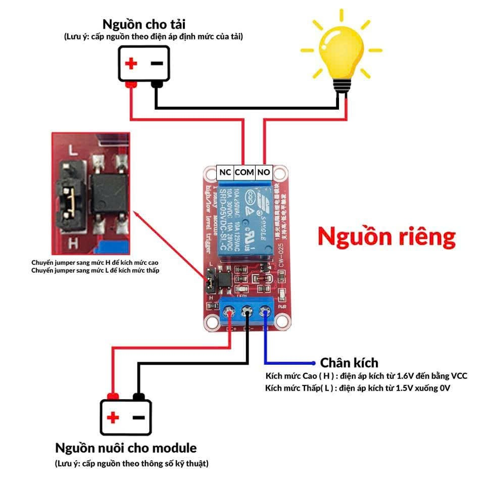

# MODULE RELAY

## Module Relay 1 kênh

Nên dùng nguồn ngoài 5V, >= 1A

🔌 Giải thích về module relay 2 kênh với chân NC – COM – NO

- Một relay hoạt động như một công tắc điện tử, cho phép điều khiển thiết bị điện (đèn, quạt, máy bơm…) bằng tín hiệu điều khiển từ vi mạch (Arduino, ESP32, PLC…).

- Relay thường có 3 chân chính cho mỗi kênh INPUT:

  - DC+ (VCC)

    • Đây là chân cấp nguồn cho relay.

    • Dây dương nguồn sẽ được nối vào đây.

    • Tùy vào mức tín hiệu kích vào chân IN là 5V hay 3.3V thì chân DC+ sẽ nhận tín hiệu tương đương là 5V hoặc 3.3V

  - DC- (GND)

    • Đây là chân nguồn âm cấp cho relay, làm mốc so sánh điện áp giữa chân DC+ với IN.

    • Dây âm nguồn sẽ được nối vào đây.

  - IN (INPUT mức tín hiệu để kích relay)

    • Chọn mức kích phù hợp, chọn 5V hay 3.3V để lựa chọn nguồn cấp cho DC+ để tương đồng mức điện áp so sánh.

    • Mức tín hiệu kích phụ thuộc vào jumper lựa chọn.

    • Dây tín hiệu điều khiển được nối vào.

  - Jumper (chân cắm quy định mức tín hiệu để kích relay)

    • Cắm chung COM với H => IN kích mức cao, mức điện áp của IN và DC+ phải bằng nhau để relay so sánh được mức điện áp.

    • Cắm chung COM với L => IN kích mức thấp.

    • Phụ thuộc muốn kích relay mức cao hay thấp (thông thường sẽ kích mức thấp).

- Relay thường có 3 chân chính cho mỗi kênh OUTPUT:

  - COM (Common)

    • Đây là chân chung, giống như điểm trung tâm của công tắc.

    • Dây nguồn sẽ được nối vào chân này. (dây tải cũng được)

  - NO (Normally Open – Thường hở)

    • Khi relay chưa kích hoạt, chân NO không nối với COM (mạch hở).

    • Khi relay được kích hoạt, COM sẽ nối với NO → dòng điện đi qua, thiết bị hoạt động.

    • Dùng khi bạn muốn thiết bị chỉ chạy khi relay bật.

  - NC (Normally Closed – Thường đóng)

    • Khi relay chưa kích hoạt, COM nối với NC (mạch kín).

    • Khi relay được kích hoạt, COM ngắt khỏi NC.

    • Dùng khi bạn muốn thiết bị luôn chạy mặc định, và tắt khi relay bật.

⚙️ Cách hoạt động

- Relay có cuộn dây điều khiển. Khi có tín hiệu (ví dụ từ Arduino xuất mức HIGH), cuộn dây tạo từ trường hút công tắc bên trong.

- Công tắc sẽ chuyển trạng thái:

  • Từ COM–NC sang COM–NO (nếu relay kích hoạt).

  • Nhờ đó, bạn có thể điều khiển dòng điện AC/DC lớn bằng tín hiệu điều khiển nhỏ từ vi mạch.

📌 Ví dụ ứng dụng

- Dùng NO: Đèn chỉ sáng khi bạn bật relay.

- Dùng NC: Quạt luôn chạy, nhưng sẽ tắt khi relay kích hoạt (ví dụ hệ thống bảo vệ).
