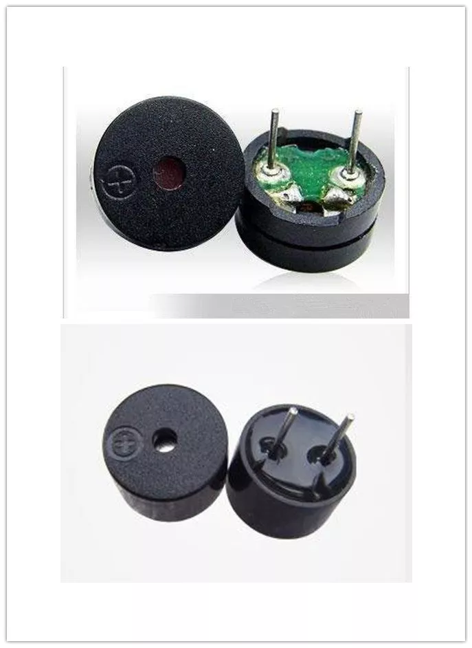

#

Có 2 loại buzzer cơ bản:

- Active buzzer

- Passive buzzer

Phân biệt bằng cách xem dưới buzzer như hình:

1️⃣ Phân biệt theo nguyên lý hoạt động (quan trọng nhất)

🔹 Active Buzzer (buzzer chủ động)

Bên trong đã có mạch dao động (oscillator)

Chỉ cần cấp điện DC → buzzer tự phát ra âm thanh

Không cần tín hiệu PWM hay xung

👉 Nói ngắn gọn:

Cấp nguồn là kêu

🔹 Passive Buzzer (buzzer thụ động)

Không có mạch dao động bên trong

Chỉ là loa piezo

Bắt buộc phải cấp tín hiệu xung (PWM / sóng vuông) mới phát ra âm thanh

👉 Nói ngắn gọn:

Không có xung → không kêu

2️⃣ Phân biệt theo điện áp cấp

| Đặc điểm            | Active Buzzer | Passive Buzzer   |
| ------------------- | ------------- | ---------------- |
| Nguồn cấp           | DC (3V, 5V…)  | Xung vuông / PWM |
| Cấp DC liên tục     | Kêu ngay      | Không kêu        |
| Điều khiển bằng PWM | Không cần     | Bắt buộc         |

3️⃣ Phân biệt theo âm thanh phát ra

🔊 Active Buzzer

Âm thanh:

Cố định (thường ~2–4 kHz)

Không đổi cao độ

Chỉ bật/tắt được

🎵 Passive Buzzer

Âm thanh:

Thay đổi được tần số

Phát nhạc, melody, beep khác nhau

Phụ thuộc vào xung điều khiển

4️⃣ Phân biệt bằng đồng hồ đo điện (thực tế – rất hay dùng)

🔹 Dùng thang đo Ohm

| Kết quả đo                        | Kết luận       |
| --------------------------------- | -------------- |
| Điện trở **rất lớn / gần vô cực** | Passive Buzzer |
| Điện trở **vài trăm Ω – vài kΩ**  | Active Buzzer  |

📌 Lý do:

Passive: chỉ là phần tử piezo → cách điện

Active: có mạch điện tử bên trong

5️⃣ Phân biệt bằng cấp nguồn thử (cách nhanh nhất)

🔹 Thử với pin 3V – 5V DC

| Hiện tượng           | Loại buzzer |
| -------------------- | ----------- |
| Cấp nguồn → kêu liền | Active      |
| Cấp nguồn → im lặng  | Passive     |

⚠️ Không để lâu quá nếu buzzer không kêu

6️⃣ Phân biệt bằng hình dạng bên ngoài (chỉ mang tính tham khảo)

⚠️ Không tuyệt đối nhưng thường đúng

| Đặc điểm     | Active                | Passive      |
| ------------ | --------------------- | ------------ |
| Tem mặt trên | Thường có chữ “**+**” | Thường không |
| Kích thước   | To hơn chút           | Nhỏ hơn      |
| Trọng lượng  | Nặng hơn              | Nhẹ          |
